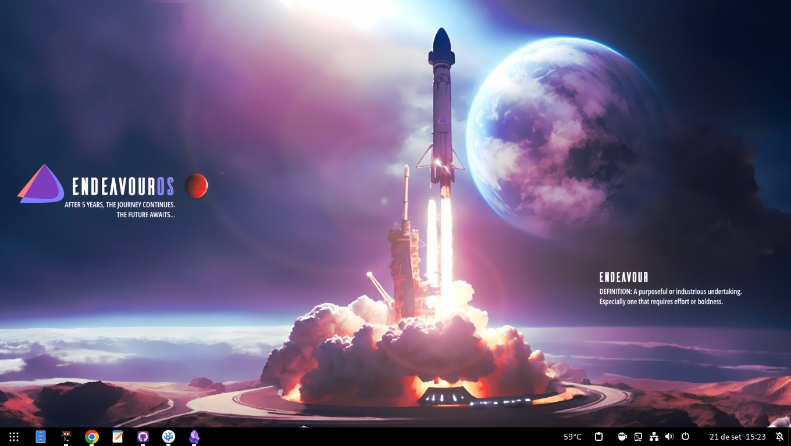

# Gnome

- [Extensões](#extens%C3%B5es)
- [Keybinds](#keybinds)
- [Aparência](#aparência)
- [Configurando o tema Adwaita para Flatpak](#configurando-o-tema-adwaita-para-flatpak)



Minha configuração do [Gnome](https://www.gnome.org/) com [Wayland](https://wayland.freedesktop.org/). Atualmente usando no [EndeavourOS](https://endeavouros.com/) (base [Arch Linux](https://archlinux.org/)).

## Extensões

- [Alphabetical App Grid](https://extensions.gnome.org/extension/4269/alphabetical-app-grid/): Deixa o menu de aplicativos em ordem alfabética;
- [Caffeine](https://extensions.gnome.org/extension/517/caffeine/): Desabilita a proteção de tela e a suspensão automática;
- [Clipboard Indicator](https://extensions.gnome.org/extension/779/clipboard-indicator/): Gerenciador de área de transferência;
- [Compact Top Bar](https://extensions.gnome.org/extension/5669/compact-top-bar/): Diminui o espaço entre os itens da barra superior;
- [Dash to Panel](https://extensions.gnome.org/extension/1160/dash-to-panel/): Deixa a dock parecida com a do Windows, além de remover a barra superior e mover seus itens para a dock;
- [Emoji Copy](https://extensions.gnome.org/extension/6242/emoji-copy/): Menu de emojis parecido com a do Windows 10;
- [GSConnect](https://extensions.gnome.org/extension/1319/gsconnect/): Implementação do [KDEConnect](https://kdeconnect.kde.org/) ao Gnome;
- [Start Overlay in Application View](https://extensions.gnome.org/extension/5040/start-overlay-in-application-view/): Faz o `Super` ser a keybind do menu de aplicativos;
- [Tray Icons: Reloaded](https://extensions.gnome.org/extension/2890/tray-icons-reloaded/): Mostra os ícones de bandeja igual ao Windows;
- [User Themes](https://extensions.gnome.org/extension/19/user-themes/): Tema do shell personalizado.

## Keybinds

- `Super`: Abre o menu de aplicativos;
- `Super+a`: Abre as notificações;
- `Super+v`: Abre o clipboard;
- `Super+.`: Abre o seletor de emojis;
- `Super+Tab`: Mostra o panorama;
- `Super+Enter`: abre o terminal;
- `Super+F11`: Tela cheia;
- `Alt+Tab`: Altera entre aplicativos.

## Aparência

- Tema e ícones: Adwaita;
- Wallpaper: <a href="/pc/imagens/endeavouros-wallpaper.png" download>Clique para baixar</a>;
- Cursor: [macOS Cursor](https://www.pling.com/p/1408466);
- Icone do menu: [Circle do Icons8](https://icons8.com.br/icon/Y56BOL5zVXx6/circle).

## Configurando o tema Adwaita para Flatpak

Mudar o tema dos programas [Flatpak](https://flatpak.org/):

``` bash
sudo flatpak override --env=GTK_THEME=Adwaita-dark
```

Corrigir o erro dos programas [Flatpak](https://flatpak.org/) com o cursor maior que o resto do sistema:

``` bash
flatpak --user override --filesystem=/home/$USER/.icons/:ro
flatpak --user override --filesystem=/usr/share/icons/:ro
```