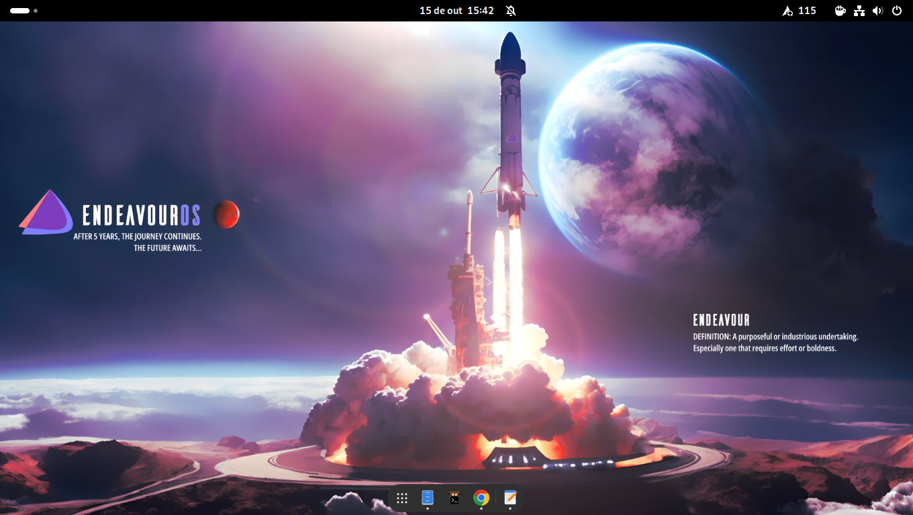

# Gnome



Minha configuração do [Gnome](https://www.gnome.org/) com [Wayland](https://wayland.freedesktop.org/). Atualmente usando no [EndeavourOS](https://endeavouros.com/) (base [Arch Linux](https://archlinux.org/)).

- [Extensões](#extens%C3%B5es)
- [Configurando o tema Adwaita para Flatpak](#configurando-o-tema-adwaita-para-flatpak)

## Extensões

- [Alphabetical App Grid](https://extensions.gnome.org/extension/4269/alphabetical-app-grid/): Deixa o menu de aplicativos em ordem alfabética;
- [Caffeine](https://extensions.gnome.org/extension/517/caffeine/): Desabilita a proteção de tela e a suspensão automática;
- [Clipboard Indicator](https://extensions.gnome.org/extension/779/clipboard-indicator/): Gerenciador de área de transferência;
- [Compact Top Bar](https://extensions.gnome.org/extension/5669/compact-top-bar/): Diminui o espaço entre os itens da barra superior;
- [Dash to Dock](https://extensions.gnome.org/extension/307/dash-to-dock/): Deixa a dock parecida com a do MacOS; 
- [Dash to Panel](https://extensions.gnome.org/extension/1160/dash-to-panel/): Deixa a dock parecida com a do Windows, além de remover a barra superior e mover seus itens para a dock;
- [Emoji Copy](https://extensions.gnome.org/extension/6242/emoji-copy/): Menu de emojis parecido com a do Windows 10;
- [Freon](https://extensions.gnome.org/extension/841/freon/): Mostra a temperatura dos hardwares na dock;
- [GSConnect](https://extensions.gnome.org/extension/1319/gsconnect/): Implementação do KDEConnect ao Gnome;
- [gTile](https://extensions.gnome.org/extension/28/gtile/): Possibilita gerenciar a jenelas como um grid;
- [Tray Icons: Reloaded](https://extensions.gnome.org/extension/2890/tray-icons-reloaded/): Mostra os ícones de bandeja igual ao Windows;
- [User Themes](https://extensions.gnome.org/extension/19/user-themes/): Tema do shell personalizado.

## Configurando o tema Adwaita para Flatpak

Mudar o tema dos programas Flatpak:

``` bash
sudo flatpak override --env=GTK_THEME=Adwaita-dark
```

Corrigir o erro dos programas Flatpak com o cursor maior que o resto do sistema:

``` bash
flatpak --user override --filesystem=/home/$USER/.icons/:ro
flatpak --user override --filesystem=/usr/share/icons/:ro
```