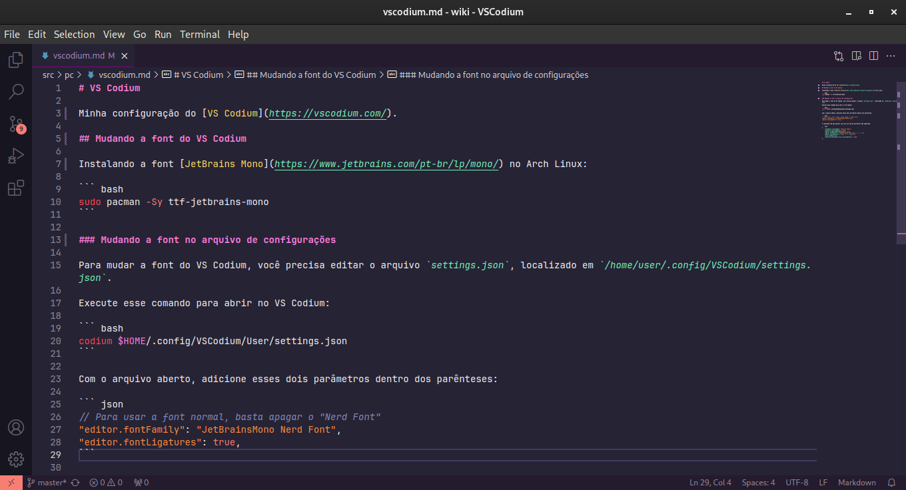

# VS Codium

Minha configuração do [VS Codium](https://vscodium.com/).

## Mudando a font do VS Codium

Instalando a font [JetBrains Mono](https://www.jetbrains.com/pt-br/lp/mono/) no Arch Linux:

``` bash
sudo pacman -Sy ttf-jetbrains-mono
```

### Mudando a font no arquivo de configurações

Para mudar a font do VS Codium, você precisa editar o arquivo `settings.json`, localizado em `/home/user/.config/VSCodium/settings.json`.

Execute esse comando para abrir no VS Codium:

``` bash
codium $HOME/.config/VSCodium/User/settings.json
```

Com o arquivo aberto, adicione esses dois parâmetros dentro dos parênteses:

``` json
// Para usar a font normal, basta apagar o "Nerd Font"
"editor.fontFamily": "JetBrainsMono Nerd Font",
"editor.fontLigatures": true,
```

O resultado tem que parecer com isso (os outros parâmetros não importam):

``` json
{
    "workbench.colorTheme": "Dracula Theme",
    "explorer.confirmDelete": false,
    "editor.largeFileOptimizations": false,
    "editor.fontFamily": "JetBrainsMono Nerd Font", // <-- font
    "editor.fontLigatures": true, // <-- ligatures
    "json.schemas": [],
    "security.workspace.trust.untrustedFiles": "open"
}
```

### Resultado

